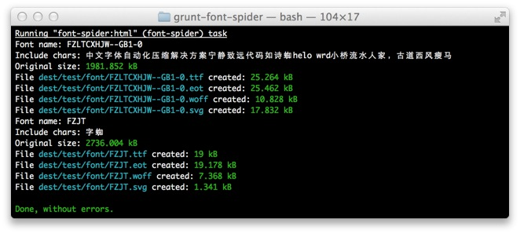

#	“字蛛”-中文字体自动化压缩工具

“字蛛”采用爬虫算法来提取本地页面、css 和字体的数据，最终可将几 MB 字体压成几十 KB 的大小。使用它后，设计师可以大胆的将精美的中文字体运用在 web 设计中，而无须受约束。




##	工作原理

1.	爬行本地 html 文档，分析所有 css 语句
2.	记录``@font-face``语句声明的字体，并且记录使用该字体的 css 选择器
3.	通过 css 选择器的规则查找当前 html 文档的节点，记录节点上的文本
4.	找到字体文件并删除没被使用的字符
5.	生成多种字体格式

##	安装

安装好 [nodejs](http://nodejs.org) 与 [gruntjs](http://gruntjs.com)，然后执行：

```
npm install grunt-font-spider --save-dev
```

1. 模块内部依赖了``jsdom``，如果遇到安装报错请看这里：<https://github.com/tmpvar/jsdom/#contextify>
2. windows 需要安装 [perl](http://www.perl.org) 环境才可以运行。

##	使用范例

### 在 css 中声明字体

```
@font-face {
  font-family: 'FZLTCXHJW--GB1-0';
  /*IE*/
  src: url('../font/FZLTCXHJW--GB1-0.eot');
  /*现代浏览器*/
  src:
    url('../font/FZLTCXHJW--GB1-0.woff') format('woff') 
    url('../font/FZLTCXHJW--GB1-0.ttf') format('truetype'),
    url('../font/FZLTCXHJW--GB1-0.svg') format('svg');
  font-weight: normal;
  font-style: normal;
}
```

声明字体后，可以使用 css``font-family``语句来使用该字体。例如：

```
.home h1, h3.title {
	font-family: 'FZLTCXHJW--GB1-0';
}
```

###	放置字体文件

工具使用 .ttf 格式的字体作为源文件来压缩，所以``@font-face``中的 src 定义的 .ttf 文件必须存在。

>.eot、.woff、.svg 的格式工具会自动生成。

###	压缩字体

编写 grunt 配置文件 Gruntfile.js 然后运行 grunt。

Gruntfile.js 示例：

```
module.exports = function(grunt) {
  grunt.initConfig({
	 // 拷贝文件到发布目录
    copy: {
      main: {
        src: './test/**',
        dest: './dest/'
      },
    },
    
	 // 压缩 html 中自定义字体
    'font-spider': {
      main: {
        src: './dest/test/**/*.html'
      }
    }

  });

  grunt.loadNpmTasks('grunt-font-spider');
  grunt.loadNpmTasks('grunt-contrib-copy');

  grunt.registerTask('default', ['copy', 'font-spider']);
};
```

##	注意事项

1.	请保证 html 文件与 css 文件均在本地（相对路径）
2.	不支持动态生成的文本
3.	不支持 js 动态插入的 css 规则
4.	不支持 css ``content``属性插入的字符

##	字体兼容性参考

格式 | IE | Firefox | Chrome | Safari | Opera | iOS Safari | Android Browser | Chrome for Android | 
----- | ----- | ----- | ----- | ----- | ----- | ----- | ----- | -----
``.eot`` | 6  | -- | -- | -- | -- | -- | -- | --
``.woff`` | 9 | 3.6 | 5 | 5.1 | 11.1 | 5.1 | 4.4 | 36 
``.ttf`` | --  | 3.5 | 4 | 3.1 | 10.1 | 4.3 | 2.2 | 36
``.svg`` | -- | -- | 4 | 3.2 | 9.6 | 3.2 | 3 | 36

来源：<http://caniuse.com/#feat=fontface>

=============

*字体受版权保护，若在网页中使用商业字体，请联系相关字体厂商购买授权*